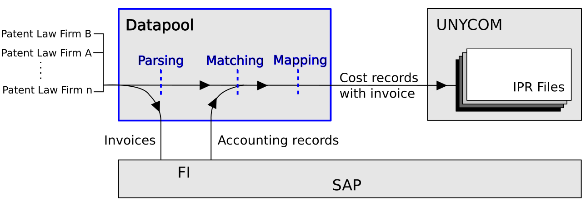
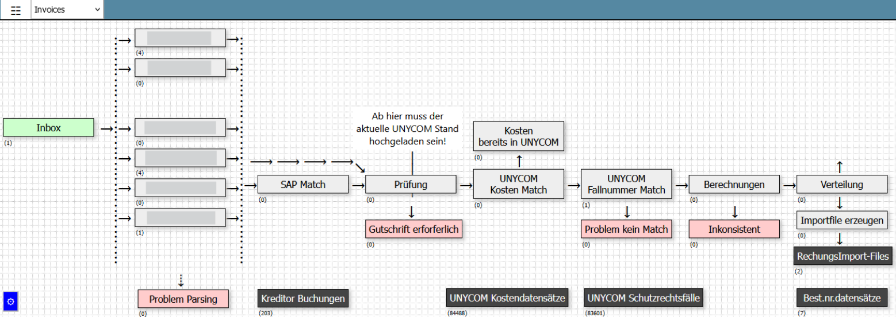
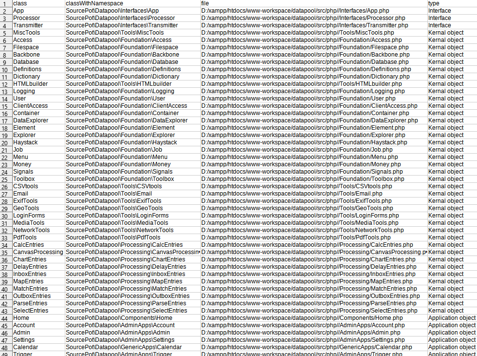

# Datapool
Many organizations run big software packages and flexibility is not necessarily their strong point. Simple customer specific adjustments are very expensive and might not survive the next software update. Moving data between the packages is even more challenging.
This framework aims to fill the gap between the big software packages such as SAP and e.g. UNYCOM in the setup of an IPR or patent department.  The software is designed to relieve people from mindless repetitive tasks, allowing them to focus on the valuable tasks.

The figure shows a typical application example in a company software setup including SAP and UNYCOM. UNYCOM is used by patent departments of larger enterprises. UNYCOM manages patent files including cost records. There can be a substantial amount of incoming invoices. The payment is usually dealt with by SAP but the invoice data (content) as well as the documentation of the payment made through SAP needs to end up in the correct UNYCOM patent case. This requires the following:
1. Parsing: Content extraction from the invoice. SAP relevant data as well as patent case specific data.
2. Matching an SAP accounting record with the patent case.
3. Mapping: Adjusting data formats and types to create a UNYCOM compatible dataset.
The Datapool framework can just achieve this.

## Features
- Very lightweight web-application with data-processing, calendar, user account and rights management, a multimedia app and a forum
- Data sources can be media-files, pdf-documents, spreadsheet-files either uploaded manually or downloaded from an email inbox
- The result of the processing can be spreadsheet-files, zip-files, emails or SMS-messages
- Data processing can be controlled manually or by trigger derived from values or calendar events
- External devices can provide data or files through a client interface
- Processes can be easily designed and adopted via a graphical user interface

## Hosting the web-application

### Requirements
This software is designed to run on a server, i.e. the user interface is the web browser. It requires **PHP 8+** and a **database**. Depending on the application requirements access to an email account might be required.

### Installation 
For the installation and creation of the first user account please refer to the video below.
1. Choose your target directory on your web server or your computer and run composer `composer create-project sourcepot/datapool {add your target directory here}`. This will create among other things the `../www/`-subdirectory, which is the www-root and should be accessible via the network, i.e. from a client web browser.
2. Create a database and a corresponding database user. Set the database collation to **utf8mb4_unicode_ci**.
3. Call the webpage through a web browser. This will create an error message since the database access needs to be set up. (Check the error log which can be found in the `../debugging/`-subdirectory.  Each error generates a JSON-file containing the error details.) 
4. Calling the webpage creates the file `../setup/Database/connect.json` which contains the database access credentials. Use a text editor to update or match the credentials with the database user credentials. 
5. Refresh the webpage. This will create an initial admin user account. The user credentials of this account can be found in `../setup/User/initAdminAccount.json`. Register your own account and use the initial admin user account to change your own account to admin access level. Delete the initial admin user account after you have set up your own admin account.
6. Make sure only the `../www/`-subdirectory is visible to the public.

https://github.com/SourcePot/datapool/assets/115737488/10464f44-4518-45e0-8654-0bc19e9b1bb0

### Initial adjustments
After you have set up your admin account you should login and update the webmaster email address **Admin &rarr; Admin &rarr; Page settings &rarr; EmailWebmaster**. Allways use the &check; button the save changes.

## Philosophy
Datapool is based on an **object collection** or `oc`, i.e. a collection objects instantiated from PHP-classes in the `../php/` folder. The object collection is created by the constructor of class `../php/Root.php` each time the web-application is called.
`../php/Root.php` provides the collection to all instantiated classes which have the method `init(array $oc)`. Typically the classes have a private property `oc` which is set/updated by the init method of the class.

The configuration file `../setup/objectList.csv` determines which objects are created and in which order. Vendor classes can be added to the object collection with the private property `registerVendorClasses` of class `../php/Root.php`

