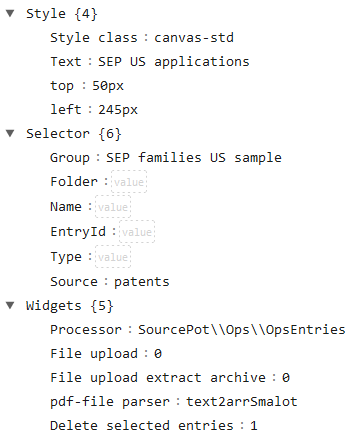
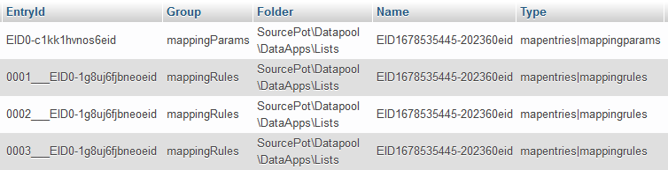

# DataApps - entry processing
Every DataApp implements the App-interface and make use of the DataExplorer-class. The DataExplorer-class provides a graphical user interface for entries of the database table dataexplorer.

## DataExplorer: `Canvas element` data structure
The entries of the dataexplorer table have following structure (array-representation):
- **Source:** dataexplorer is the database table name
- **Group:** is set to `Canvas elements` for graphic elements of the user interface
- **Folder:** is the name of the PHP-class including the namespace of the DataApp the Canvas element belongs to
- **Name:** is the initial HTML tag content of the Canvas element
- **EntryId:** is the unique identifier
- **Content:** is an array that contains all data with relation to the Canvas element, e.g. the style information, the database selector with relation to the Canvas element and Widgets such as the linked processor
- **Params:** is an array that contains the Canvas element meta information
- **Expires:** is the date when the entry will be deleted
- **Read:** is the access byte defining the read permission with regard to the entry
- **Write:** is the access byte defining the write permission with regard to the entry
- **Owner:** is the unique identifier of the party who created the entry

## DataExplorer: `Canvas element` data structure array-key Content

## DataExplorer: Processor classes
Processor classes implement the interface `\SourcePot\Datapool\Interfaces\Processor`. Each `Canvas element` can be linked to one processor.
The processor runs on the data selected by `Canvas Element[Content][Selector]`. A processor linked to a `Canvas element` is linked to one entry storing parameters and multiple entries storing rules.
Entries storing parameters and rules are stored in the database table named the same as the processor class, e.g. mapentries. As an example following screenshot of the mapentries table:

# Example DataApp Invoices
The DataApp Invoices implements the App-interface and provides the DataExplorer. Canvas elements generated by Invoices are stored in the dataexplorer table of the database as described above.
The Invoices class stores entries in the invoices table of the database. These entries represent the data processed by using the Invoices class. Data entries contain structured information mainly in the `Content`-column or `Content`-array-key respectivly.
Additionally a maximum of one file can be linked to an entry. This file can be any kind of file, e.g. a zip-, mp4-, csv-file etc. pdf-File can be parsed and the text copied to `Content`.

There are two entry types of invoice table entries: parameter and rules, each related to a processor of a `Canvas element`.
