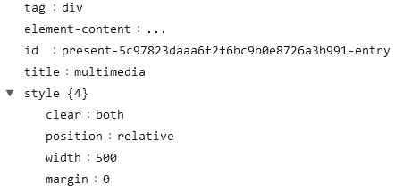
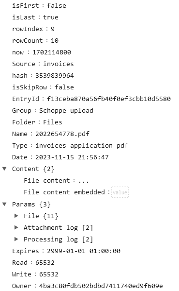
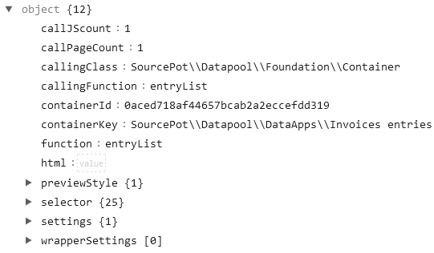

# Folder structure and description
- **AdminApps:** this folder contains PHP-classes that implement the App-interface for administration purposes
- **Components:** this folder contains PHP-classes that implement the App-interface for core web-application services, e.g. Home, Login, Logout
- **DataApps:** this folder contains PHP-classes that implement the App-interface for data processing purposes
- **GenericApps:** this folder contains PHP-classes that implement the App-interface for generic purposes, e.g. Calendar, Forum
- **Interfaces:** this folder contains PHP-interface definitions
- **Foundation:** this folder contains PHP-classes that provide core functionality of the web application
- **Processing:** this folder contains PHP-classes that implement data processors, e.g. parser, mapper, matcher etc.
- **Tools:** this folder contains PHP-classes that provide support functionality
- **Root.php**: the www-scripts create an instance of this PHP-class, which creates the object collection based on `..\setupt\objectList.csv`. It does all initializations, creates the standard directories and invokes all init methods 

# Data-structures as arrays
The web application makes use of a few array based data-structures, for example:
- **element**: html-tags are based on data held by this array
- **entry**: is the basic data-structure stored in the database and proceeed by data processors
- **arr**: is the data-structure for methods of the web-application that compile html-strings

## `element` data-structure example

## `entry` data-structure example

## `arr` data-structure example

