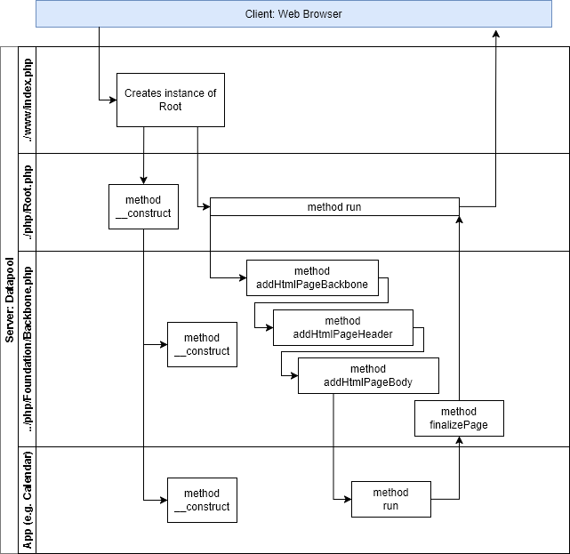

# Folder structure and description
- **media:** this folder contains javascript, style-script and all fixed media files of the web-application
- **index.php:** is the main script of the web-application 
- **job.php:** if any job is outstanding this script invokes this next job
- **js.php:** this script is used for ajax requests
- tmp: this folder contains temporary files such as pics, videos etc in short-lived subdirectories 

# Calling index.php script flow chart

# Calling js.php script flow chart

# Calling job.php script flow chart

# Calling resource.php script flow chart
